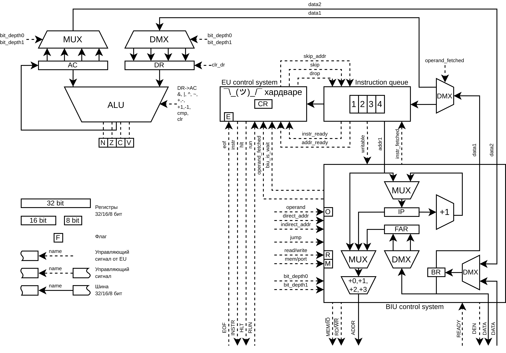
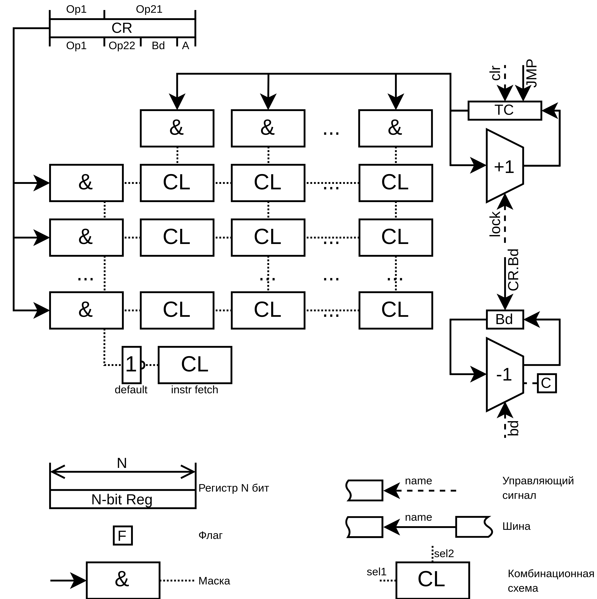

# Геля Марк P3232

Вариант: `alg -> asm | acc | neum | hw | instr | binary -> struct | stream | port | pstr | prob2 | cache`

Базовый вариант (без усложнения)

## Язык программирования

Описание синтаксиса языка в форме БНФ:

```bnf
<program> ::= <line>* <EOF>

<line> ::= <label>? <instruction>? <EOL>

<label> ::= <name> ":"

<name> ::= <NAME>

<instruction> ::= <op> <operand>*

<op> ::= <op0> | <op1> | <op2> | <op3>

<op0> ::= "HLT"

<op1> ::= "WORD" | "SHORT" | "BYTE" | "BYTES"

<op2> ::= "LD" | "ST" | "ADD" | "SUB" | "INC" | "DEC" | "OR" | "AND" | "XOR" | "CMP" | "JMP" | "JE" | "JZ" | "JNE" | "JNZ" | "JG" | "JGE" | "JL" | "JLE" | "JEOF"

<op3> ::= "IN" | "OUT"

<operand> ::= <integer> | <name> | <final_addr> | <final_addr_label> | <bit_depth> | <string>

<final_addr> ::= "*" <integer>

<final_addr_label> ::= "*" <name>

<bit_depth> ::= "b8" | "b16" | "b24" | "b32"

<integer> ::= <DEC_INTEGER> | <HEX_INTEGER> | <OCT_INTEGER> | <BIN_INTEGER>

<string> ::= <StringVar>

<EOF> ::= [end of file]

<EOL> ::= [\r\n]+

<NAME> ::= [a-zA-Z][a-zA-Z0-9]*

<DEC_INTEGER> ::= [0-9]+

<OCT_INTEGER> ::= '0' [qo][0-7]+

<HEX_INTEGER> ::= '0' [xh][0-9A-F]+

<BIN_INTEGER> ::= '0' [b][01]+

<StringVar> ::= '"' (~["\\\r\n] | <ESCAPED_CHAR>)+ '"'

<ESCAPED_CHAR> ::= '\\' ('n' | 'r' | 't' | '"' | '\\')

```

Пример программы:

```asm
        JMP     start
hello:  BYTES   "Hello, world!"
ptr0:   SHORT   hello
ptr:    SHORT   hello
i:      SHORT   0
start:
loop:
        LD      *ptr    b8
        OUT     0
        LD      ptr     b16
        INC
        ST      ptr     b16
        LD      i       b16
        CMP     *ptr0   b8
        JG      end
        INC
        ST      i       b16
        JMP     loop
end:
        HLT

```

Язык поддерживает 4 типа данных:
```
1. WORD - 32bit
2. SHORT - 16bit
3. BYTE - 8 bit
4. BYTES <N> - N bytes
4. BYTES "<text>" - len(<text>)
```

Результат всех математических операций будет "обрезан" до младших 33-бит, 33-ий бит попадёт в carry флаг.


## Организация памяти

Процессор поддерживает два типа адресации:
1. Прямая адресация `LD label`
2. Косвенная адресация `LD *label`

Система построена по архитектуре фон Неймана, то есть разделения команд и данных нет:.

Память работает в линейном, плоском адресном пространстве.

### Регистры

Система обладает аккумуляторной архитектурой. Поэтому большинство операций происходит над аккумулятором. Остальные регистры устанавливаются процессором.

Никакие переменные не отображаются на регистры, так как по сути нам доступен всего один регистр -- аккумулятор.

1. `AC` (accumulator) -- 32-битный регистр общего назначения, используемый для хранения операнда или результата арифметических и логических операций.
2. `DR` (data register) -- 32-битный регистр общего назначения, используемый для хранения второго операнда и для загрузки значения а `AC`.
3. `CR` (command register) -- 8-битный регистр, хранящий код текущей выполняемой команды. Содержит информацию о коде операции и режиме адресации.
4. `IP` (instruction pointer) -- 16-битный регистр, указывающий на адрес следующей команды, которая будет выбрана из памяти. Увеличивается на единицу после извлечения каждого байта.
5. `FAR` (final addres register) -- 6-битный регистр, используемый для хранения конечного адреса операнда (косвенная адресация)
6. `BR` (buffer register) -- используется для загрузки операндов из памяти и устройст, комманд, конечного адреса и выгрузки данных в память и внешнии устройства.
7. 4 8-битных регистра очереди инструкций. (первый в очереди -- инструкция, первый и второй -- адрес)

### Флаги

1. `N` (negative) -- Устанавливается в 1, если результат операции арифметического вычитания или логического сравнения отрицателен.
2. `Z` (zero) -- Устанавливается в 1, если результат операции равен нулю.
3. `C` (carry) -- Устанавливается в 1, если произошел перенос из старшего бита во время операции сложения или вычитания.
4. `V` (overflow) -- Устанавливается в 1, если произошел переполнением во время операции сложения или вычитания со знаком.
5. `E` (End of file) -- Устаавливается внешним устройством для индикации завершения потока, сбрасывается при `JEOF` (Jump if end of file)
6. `O`, `R`, `M` (operand, read, memory) -- Служебные флаги для работы BIU


### Память

Размер машинного слова -- 32 бит.

```
 ╔═════════════════╗
 ║First instruction║
 ╚═════════════════╝
 ╔═════════════════╗
 ║                 ║
 ║                 ║
 ║                 ║
 ║                 ║
 ║   Instruction   ║
 ║       and       ║
 ║   data memory   ║
 ║                 ║
 ║                 ║
 ║                 ║
 ║                 ║
 ║                 ║
 ║                 ║
 ║                 ║
 ║                 ║
 ║                 ║
 ╚═════════════════╝
```

## Система команд

### Особенности процессора
Прерывания отсутствуют.

Флаг `E` (EOF) используется для индикации конца потока.

Для обращения к внешнему устройстве выставить `wire_mem=False`, `wire_read=False/True`, `wire_data_enable=True`, `bus_data` (для записи), `bus_addr` для выбора устройства (`IN 0x0005` -- запись в устройство номер 5)

### Набор инструкций

Инструкции завершения программы:

- `HLT` (остановка) -- 8-bit. Останавливает выполнение программы.

Инструкции манипуляции данными:

- `LD` (загрузить) -- 24-bit. Загружает значение из памяти в аккумулятор.
- `ST` (сохранить) -- 24-bit. Сохраняет значение из аккумулятора в память.
- `ADD` (сложить) -- 24-bit. Складывает значение из аккумулятора и операнда и сохраняет результат в аккумуляторе.
- `SUB` (вычесть) -- 24-bit. Вычитает значение операнда из значения в аккумуляторе и сохраняет результат в аккумуляторе.
- `INC` (инкремент) -- 8-bit. Инкрементирует значение в памяти или аккумуляторе.
- `DEC` (декремент) -- 8-bit. Декрементирует значение в памяти или аккумуляторе.
- `OR` (логическое ИЛИ) -- 24-bit.  Выполняет операцию логического ИЛИ между аккумулятором и операндом и сохраняет результат в аккумуляторе.
- `AND` (логическое И) -- 24-bit.  Выполняет операцию логического И между аккумулятором и операндом и сохраняет результат в аккумуляторе.
- `XOR` (логическое исключающее ИЛИ) -- 24-bit.  Выполняет операцию логического исключающего ИЛИ между аккумулятором и операндом и сохраняет результат в аккумуляторе.
- `CMP` (сравнить) -- 24-bit. Сравнивает значения в аккумуляторе и операнде и устанавливает флаги условий.

Инструкции ветвления:

- `JMP` (перейти) -- 24-bit.  Переходит на адрес, указанный операндом.
- `JE` (перейти при равенстве) -- 24-bit. Переходит на адрес, указанный операндом, если значение в аккумуляторе равно нулю.
- `JZ` (перейти при нуле) -- 24-bit.  Переходит на адрес, указанный операндом, если значение в аккумуляторе равно нулю.
- `JNE` (перейти при неравенстве) -- 24-bit.  Переходит на адрес, указанный операндом, если значение в аккумуляторе не равно нулю.
- `JNZ` (перейти при ненуле) -- 24-bit.  Переходит на адрес, указанный операндом, если значение в аккумуляторе не равно нулю.
- `JG` (перейти при больше) -- 24-bit.  Переходит на адрес, указанный операндом, если значение в аккумуляторе больше нуля.
- `JGE` (перейти при больше или равно) -- 24-bit.  Переходит на адрес, указанный операндом, если значение в аккумуляторе больше или равно нулю.
- `JL` (перейти при меньше) -- 24-bit. Переходит на адрес, указанный операндом, если значение в аккумуляторе меньше нуля.
- `JLE` (перейти при меньше или равно) -- 24-bit. Переходит на адрес, указанный операндом, если значение в аккумуляторе меньше или равно нулю.
- `JEOF` (перейти при конце файла) -- 24-bit. Переходит на адрес, указанный операндом, если достигнут конец файла ввода.

Инструкции ввода-вывода:

- `IN` (ввод) -- 24-bit. Считывает байт из последовательного устройства и сохраняет его в аккумуляторе.
- `OUT` (вывод) -- 24-bit. Выводит байт из аккумулятора в последовательное устройство.

### Способ кодирования инструкций

- 5-bit: код операции (opcode)
- 2-bit: 8/16/24/32 битный операнд
- 1-bit: прямая/косвеная адресация
- 16-bit: адрес

В зависимости от opcode отставшися 3 бита могут быть интерпретированы как расширение opcode. Пример: `HLT`, `INC`, `DEC`

## Транслятор

`python compiler.py <input_file> <output_file>`

## Модель процессора

`python machine.py <input_code_file> <input_data_file>`

### DataPath


### ControlUnit


## Тестирование

Тестирование выполняется при помощи golden test-ов.

